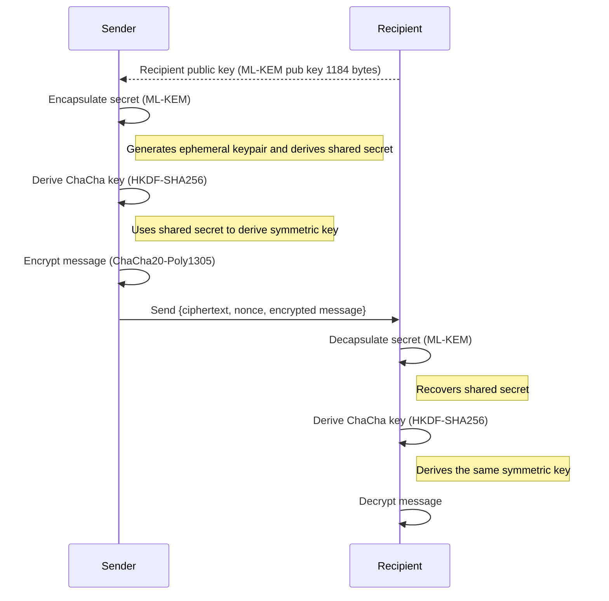

# Kychacha-crypto: Post-Quantum Secure Encryption Protocol
## A post-quantum simple to use implementation for ML-KEM and ChaCha20

Hybrid cryptographic implementation using:
- **ML-KEM** (formerly Crystals-Kyber): Post-Quantum secure Key Encapsulation Mechanism (KEM) for key exchange, standardized by NIST.
- **ChaCha20-Poly1305**: Authenticated symmetric encryption.

## Language Bindings

### Ruby Gem

A Ruby gem binding is available that leverages the FFI interface to provide Kychacha functionality in Ruby applications: [kychacha_gem](https://github.com/Nichokas/kychacha_gem)

## Architecture

The following diagram describes the protocol flow between the "Sender" and the "Recipient":

> *Note*: During the encapsulation process on the sender's side, an ephemeral keypair is generated.

## Usage and documentation
https://docs.rs/kychacha_crypto

## Safety Considerations

2. **Randomness**: Depends on the secure generator of the system.
3. **HKDF context**: Used for protocol binding.
4. **Nonces**: Generated with CSPRNG for each message.
