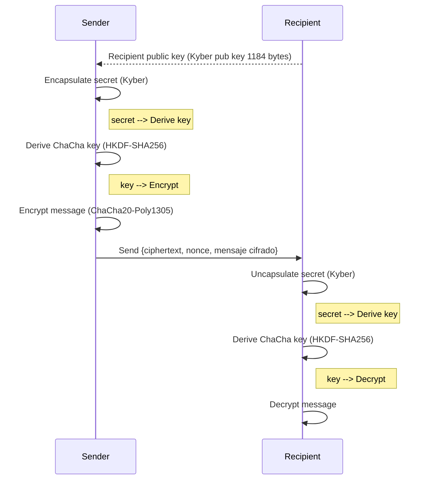

# Kychacha-crypto: Post-Quantum Secure Encryption Protocol
[](https://github.com/Nichokas/kychacha_crypto/actions/workflows/build.yaml)
[](https://codspeed.io/Nichokas/kychacha_crypto)

Hybrid cryptographic implementation using:
- **Kyber** (Post-Quantum KEM) for key exchange.
- **ChaCha20-Poly1305** for symetric cypher.

## Architecture



## Technical Specifications

### 1. Key Exchange Protocol
- **Algorithm**: Kyber-1024 (NIST PQC Round 3)
- **Key Parameters**:
  ```rust
  pub const KYBER_PUBLIC_KEY_BYTES: usize = 1184;
  pub const KYBER_SECRET_KEY_BYTES: usize = 2400;
  pub const KYBER_CIPHERTEXT_BYTES: usize = 1568;
  ```
- **Key Derivation**: HKDF-SHA256 with specific context

### 2. Symetric cypher
- **Algorithm**: ChaCha20-Poly1305 (IETF variant)
- **Key size**: 256 bits
- **Nonce**: 96 bits (randomly generated by the message)

### 3. Encrypted data format
```rust
#[derive(Serialize, Deserialize, Debug)]
pub struct EncryptedData {
    pub ciphertext: String,    // Base64(Kyber ciphertext)
    pub nonce: String,         // Base64(ChaCha nonce)
    pub encrypted_msg: String, // Base64(ciphertext)
}
```

## Basic usage

### Key generation
```rust
use kychacha_crypto::generate_keypair;

let server_kp = generate_keypair()?;
```

### Encrypt
```rust
use kychacha_crypto::{encrypt, PublicKey};

let message = b"Mensaje secreto";
let encrypted_data = encrypt(&server_pk, message)?;
```

### Decrypt
```rust
use kychacha_crypto::{decrypt, Keypair};

let decrypted = decrypt(&encrypted_data_json, &server_kp)?;
```

## Safety Considerations

2. **Randomness**: Depends on the secure generator of the system.
3. **HKDF context**: Used for protocol binding.
4. **Nonces**: Generated with CSPRNG for each message.
