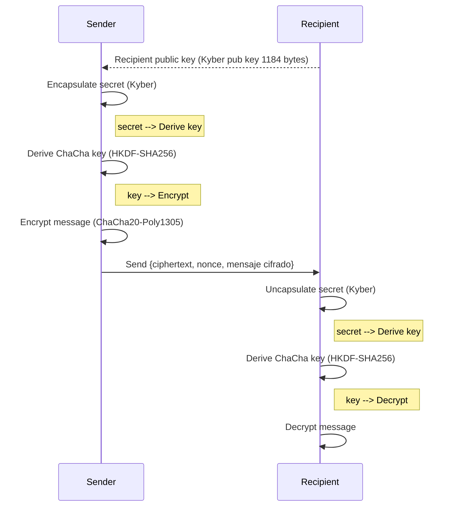

# Kychacha-crypto: Post-Quantum Secure Encryption Protocol
[](https://github.com/Nichokas/kychacha_crypto/actions/workflows/build.yaml)
[](https://codspeed.io/Nichokas/kychacha_crypto)
[](https://crates.io/crates/kychacha_crypto)

# THIS PROJECT IS UNDER ACTIVE DEVELOPMENT, IT MAY CONTAIN BREAKING CHANGES ON UPDATES.

Hybrid cryptographic implementation using:
- **Kyber** (Post-Quantum KEM) for key exchange.
- **ChaCha20-Poly1305** for symetric cypher.

## Architecture



## Technical Specifications

### 1. Key Exchange Protocol
- **Algorithm**: Kyber-1024 (NIST PQC Round 3)
- **Key Parameters**:
  ```rust
  pub const KYBER_PUBLIC_KEY_BYTES: usize = 1184;
  pub const KYBER_SECRET_KEY_BYTES: usize = 2400;
  pub const KYBER_CIPHERTEXT_BYTES: usize = 1568;
  ```
- **Key Derivation**: HKDF-SHA256 with specific context

### 2. Symetric cypher
- **Algorithm**: ChaCha20-Poly1305 (IETF variant)
- **Key size**: 256 bits
- **Nonce**: 96 bits (randomly generated by the message)

### 3. Encrypted data format
```rust
#[derive(Serialize, Deserialize, Debug)]
pub struct EncryptedData {
    pub ciphertext: String,    // Base64(Kyber ciphertext)
    pub nonce: String,         // Base64(ChaCha nonce)
    pub encrypted_msg: String, // Base64(ciphertext)
}
```

## Basic usage

### Key generation
```rust
use kychacha_crypto::{generate_keypair, Keypair};

// Generate Kyber1024 keypair
let server_kp: Keypair = generate_keypair()?;
```

### Encrypt
```rust
use kychacha_crypto::{encrypt_binary, PublicKey};

let message = b"Secret message";
// Encrypt using server's public key
let encrypted_data: Vec<u8> = encrypt_binary(&server_kp.public, message)?;

// Send encrypted_data (binary blob) to server
```

### Decrypt
```rust
use kychacha_crypto::{decrypt_binary, Keypair};

// Receive encrypted_data as &[u8] from client
let decrypted_message = decrypt_binary(&encrypted_data, &server_kp)?;
assert_eq!(decrypted_message, "Secret message");
```

### Key Serialization (for storage/transmission)
```rust
use kychacha_crypto::{public_key_to_bytes, secret_key_to_bytes};

// Convert keys to byte vectors
let pk_bytes: Vec<u8> = public_key_to_bytes(&server_kp.public);
let sk_bytes: Vec<u8> = secret_key_to_bytes(&server_kp.secret);

// Reconstruct keys from bytes
let public_key = PublicKey::from(pk_bytes.as_slice());
let secret_key = SecretKey::from(sk_bytes.as_slice());
```

## Safety Considerations

2. **Randomness**: Depends on the secure generator of the system.
3. **HKDF context**: Used for protocol binding.
4. **Nonces**: Generated with CSPRNG for each message.
